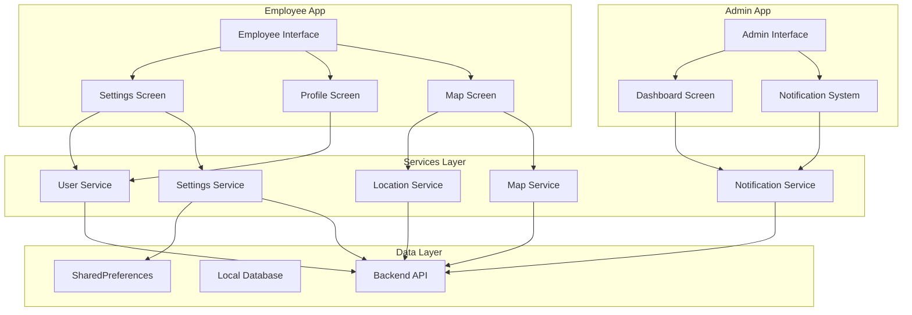

# Design Document: Comprehensive App Improvements

## Overview

This design document outlines the technical implementation for comprehensive improvements to the FieldCheck application, addressing critical functionality issues across both employee and admin interfaces. The improvements focus on fixing dysfunctional features, enhancing user experience, and resolving synchronization and display issues that impact daily operations.

The solution encompasses four major improvement areas:
1. **Employee App Settings Fixes** - Location toggle synchronization, Bluetooth removal, save functionality, and offline sync clarity
2. **Profile Editing Redesign** - Modal to page conversion, phone number editing, and SMS settings preservation
3. **Map Functionality Enhancement** - Navigation integration, search implementation, and center/fit button functionality
4. **Admin App Fixes** - Real-time notifications, employee information display, and dark mode visibility

## Architecture

### System Architecture Overview

The FieldCheck application follows a Flutter-based mobile architecture with the following key components:



### Component Interaction Model

The improvements require modifications to existing components and introduction of new synchronization mechanisms:

1. **Settings Management**: Enhanced with real-time synchronization between UI state and persistent storage
2. **Profile Management**: Redesigned from modal-based to page-based navigation with expanded editing capabilities
3. **Map Integration**: Improved search functionality and navigation controls with proper state management
4. **Notification System**: Real-time counter updates with cross-session synchronization
5. **Theme Management**: Enhanced dark mode with proper contrast ratios and accessibility compliance

## Components and Interfaces

### 1. Enhanced Settings Screen Component

**File**: `field_check/lib/screens/settings_screen.dart`

**Key Modifications**:
- Remove Bluetooth beacon toggle and related UI elements
- Add save button with state management
- Enhance location toggle with visual synchronization
- Improve offline sync status indicators

**New Interface Methods**:
```dart
class SettingsScreenState {
  // Enhanced state management
  bool _hasUnsavedChanges = false;
  bool _isSaving = false;
  
  // Location toggle synchronization
  void _syncLocationToggleWithIcon() async {
    // Synchronize toggle state with target icon within 100ms
  }
  
  // Save functionality
  Future<void> _saveSettings() async {
    // Persist all settings with confirmation feedback
  }
  
  // Offline sync clarity
  Widget _buildOfflineSyncStatus() {
    // Display clear offline mode indicators and pending sync counts
  }
}
```

### 2. Profile Page Component (New)

**File**: `field_check/lib/screens/employee_profile_page.dart`

**Purpose**: Replace the existing profile modal with a dedicated page for comprehensive profile editing.

**Key Features**:
- Full-screen profile editing interface
- Phone number editing capability
- SMS settings configuration
- Enhanced navigation with proper back button support
- Form data preservation during navigation

**Interface Structure**:
```dart
class EmployeeProfilePage extends StatefulWidget {
  const EmployeeProfilePage({Key? key}) : super(key: key);
}

class _EmployeeProfilePageState extends State<EmployeeProfilePage> {
  final _formKey = GlobalKey<FormState>();
  bool _hasUnsavedChanges = false;
  
  // Form controllers
  late TextEditingController _nameController;
  late TextEditingController _emailController;
  late TextEditingController _phoneController;
  late TextEditingController _smsSettingsController;
  
  // Navigation handling
  Future<bool> _onWillPop() async {
    // Handle unsaved changes warning
  }
  
  // Save functionality
  Future<void> _saveProfile() async {
    // Save profile with phone number and SMS settings
  }
}
```

### 3. Enhanced Map Screen Component

**File**: `field_check/lib/screens/map_screen.dart`

**Key Enhancements**:
- Functional location search with autocomplete
- Center map button with geofence positioning
- Fit map button with intelligent bounds calculation
- Search result validation and prioritization

**New Methods**:
```dart
class _MapScreenState extends State<MapScreen> {
  // Search functionality
  List<Location> _searchResults = [];
  bool _isSearching = false;
  
  Future<void> _performLocationSearch(String query) async {
    // Implement functional location search with validation
  }
  
  // Center map functionality
  Future<void> _centerMapOnGeofence() async {
    // Center map on current geofence with animation
  }
  
  // Fit map functionality
  Future<void> _fitMapToVisibleItems() async {
    // Calculate bounds and adjust zoom for all visible items
  }
  
  // Search result handling
  void _selectSearchResult(Location location) {
    // Center map on selected location with visual indicator
  }
}
```

### 4. Enhanced Admin Dashboard Component

**File**: `field_check/lib/screens/admin_dashboard_screen.dart`

**Key Improvements**:
- Real-time notification counter with accurate counts
- Employee information display in all relevant interfaces
- Enhanced dark mode with proper contrast ratios

**New State Management**:
```dart
class _AdminDashboardScreenState extends State<AdminDashboardScreen> {
  // Notification management
  int _unreadNotificationCount = 0;
  StreamSubscription<int>? _notificationCountSubscription;
  
  // Employee information display
  Map<String, EmployeeInfo> _employeeInfoCache = {};
  
  // Dark mode enhancements
  bool _isDarkMode = false;
  
  // Real-time notification updates
  void _subscribeToNotificationUpdates() {
    // Subscribe to real-time notification count changes
  }
  
  // Employee info display
  Widget _buildEmployeeInfoDisplay(String employeeId) {
    // Display employee name and ID consistently
  }
}
```

### 5. Settings Service Enhancement

**File**: `field_check/lib/services/settings_service.dart` (New)

**Purpose**: Centralized settings management with persistence and synchronization.

```dart
class SettingsService {
  static const String _locationToggleKey = 'user.locationTrackingEnabled';
  static const String _offlineModeKey = 'user.offlineMode';
  
  // Settings persistence
  Future<void> saveSettings(Map<String, dynamic> settings) async {
    // Save to local storage and backup to server
  }
  
  // Settings restoration
  Future<Map<String, dynamic>> loadSettings() async {
    // Load from local storage with server fallback
  }
  
  // Conflict resolution
  Future<Map<String, dynamic>> resolveSettingsConflict(
    Map<String, dynamic> local,
    Map<String, dynamic> server,
  ) async {
    // Implement conflict resolution strategy
  }
}
```

### 6. Notification Service Enhancement

**File**: `field_check/lib/services/notification_service.dart`

**Enhanced Methods**:
```dart
class NotificationService {
  final StreamController<int> _notificationCountController = 
      StreamController<int>.broadcast();
  
  Stream<int> get notificationCountStream => _notificationCountController.stream;
  
  // Real-time count updates
  Future<void> markAsRead(String notificationId) async {
    // Mark notification as read and update count immediately
  }
  
  // Cross-session synchronization
  Future<void> syncNotificationCounts() async {
    // Synchronize counts across browser sessions
  }
}
```

## Data Models

### Enhanced User Model

**File**: `field_check/lib/models/user_model.dart`

**Additional Fields**:
```dart
class UserModel {
  // Existing fields...
  
  // Enhanced phone number support
  final String? phoneNumber;
  final bool smsNotificationsEnabled;
  final Map<String, dynamic>? smsSettings;
  
  // Settings synchronization
  final DateTime? lastSettingsSync;
  final Map<String, dynamic>? pendingSettingsChanges;
}
```

### Settings Model (New)

**File**: `field_check/lib/models/settings_model.dart`

```dart
class SettingsModel {
  final bool locationTrackingEnabled;
  final bool offlineMode;
  final ThemeMode themeMode;
  final Map<String, dynamic> customSettings;
  final DateTime lastModified;
  final bool hasUnsavedChanges;
  
  const SettingsModel({
    required this.locationTrackingEnabled,
    required this.offlineMode,
    required this.themeMode,
    required this.customSettings,
    required this.lastModified,
    this.hasUnsavedChanges = false,
  });
  
  // Serialization methods
  Map<String, dynamic> toJson();
  factory SettingsModel.fromJson(Map<String, dynamic> json);
  
  // Conflict resolution
  SettingsModel mergeWith(SettingsModel other);
}
```

### Notification Model Enhancement

**File**: `field_check/lib/models/notification_model.dart`

**Enhanced Fields**:
```dart
class NotificationModel {
  // Existing fields...
  
  // Employee information
  final String? employeeId;
  final String? employeeName;
  final EmployeeInfo? employeeInfo;
  
  // Real-time updates
  final DateTime lastUpdated;
  final bool requiresRealTimeUpdate;
}

class EmployeeInfo {
  final String id;
  final String name;
  final String? employeeCode;
  final String? department;
  
  const EmployeeInfo({
    required this.id,
    required this.name,
    this.employeeCode,
    this.department,
  });
}
```

## Correctness Properties

*A property is a characteristic or behavior that should hold true across all valid executions of a system-essentially, a formal statement about what the system should do. Properties serve as the bridge between human-readable specifications and machine-verifiable correctness guarantees.*

### Property 1: Location Toggle Visual Synchronization

*For any* location toggle state change, the Target_Icon visual indicator SHALL reflect the toggle state within 100ms, displaying a slash when off and no slash when on.

**Validates: Requirements 1.1, 1.2, 1.3**

### Property 2: Settings Persistence Round Trip

*For any* settings configuration, saving and then loading the settings SHALL produce an equivalent configuration with all changes preserved.

**Validates: Requirements 3.3, 13.1, 13.3**

### Property 3: Offline Sync Status Accuracy

*For any* offline mode state and pending sync item count, the UI indicators SHALL accurately reflect the current offline status and display the correct count of pending items.

**Validates: Requirements 4.1, 4.2**

### Property 4: Map Search Result Validation

*For any* location search query, all returned results SHALL be validated against the known location database and prioritize geofence locations over other matches.

**Validates: Requirements 7.2, 14.1, 14.2**

### Property 5: Map Navigation Centering

*For any* geofence location or GPS position, the center map button SHALL position the map view on the target location with appropriate zoom level and animation.

**Validates: Requirements 8.1, 8.4**

### Property 6: Map Bounds Calculation

*For any* set of visible map items (geofences and markers), the fit map button SHALL calculate bounds that include all items with appropriate padding and minimum zoom constraints.

**Validates: Requirements 9.1, 9.2, 9.3, 9.4**

### Property 7: Notification Counter Accuracy

*For any* notification state changes (new notifications, mark as read, mark all as read), the notification counter SHALL immediately reflect the accurate count of unread notifications.

**Validates: Requirements 10.1, 10.2, 10.5**

### Property 8: Employee Information Display Consistency

*For any* interface displaying employee information (message popups, notifications, task submissions), the employee name and ID SHALL be formatted consistently and displayed when available.

**Validates: Requirements 11.1, 11.2, 11.3, 11.4**

### Property 9: Dark Mode Contrast Compliance

*For any* text element in dark mode, the contrast ratio between text and background SHALL meet accessibility standards with light-colored text on dark backgrounds.

**Validates: Requirements 12.1, 12.5**

### Property 10: Settings Conflict Resolution

*For any* conflicting settings between local storage and server versions, the conflict resolution mechanism SHALL produce a consistent merged result that preserves user preferences where possible.

**Validates: Requirements 13.4**

### Property 11: Form Data Preservation

*For any* navigation away from and return to the profile page with unsaved form data, the form state SHALL be preserved and restored accurately.

**Validates: Requirements 15.3**

## Error Handling

### Settings Management Errors

1. **Save Failure Recovery**:
   - Display user-friendly error messages with retry options
   - Maintain unsaved changes in memory for retry attempts
   - Provide offline mode fallback for connectivity issues

2. **Settings Conflict Resolution**:
   - Implement last-write-wins strategy with user notification
   - Provide manual conflict resolution interface for critical settings
   - Log conflicts for administrative review

### Profile Management Errors

1. **Phone Number Validation**:
   - Implement comprehensive phone number format validation
   - Provide clear error messages for invalid formats
   - Support international phone number formats

2. **Navigation State Errors**:
   - Handle unsaved changes with confirmation dialogs
   - Implement form state recovery after app lifecycle events
   - Provide graceful degradation for navigation failures

### Map Functionality Errors

1. **Search Failures**:
   - Handle network timeouts with cached results
   - Provide alternative search suggestions for no results
   - Implement progressive search with partial matches

2. **Location Service Errors**:
   - Handle GPS unavailability with last known location
   - Provide manual location selection fallback
   - Display clear error messages for location permission issues

### Admin Interface Errors

1. **Notification System Failures**:
   - Implement retry mechanisms for failed notification updates
   - Provide manual refresh options for stale data
   - Handle WebSocket connection failures gracefully

2. **Employee Information Errors**:
   - Display placeholder information for missing employee data
   - Implement caching with expiration for employee information
   - Handle employee data synchronization failures

## Testing Strategy

### Unit Testing Approach

**Framework**: Flutter Test with Mockito for service mocking

**Coverage Areas**:
1. **Settings Management**: Test save/load operations, conflict resolution, and state synchronization
2. **Profile Management**: Test form validation, navigation handling, and data persistence
3. **Map Functionality**: Test search algorithms, bounds calculation, and location services
4. **Notification System**: Test counter updates, real-time synchronization, and cross-session consistency

### Property-Based Testing Implementation

**Framework**: Dart Check (QuickCheck for Dart)

**Configuration**: Minimum 100 iterations per property test

**Property Test Implementation**:

```dart
// Example property test for location toggle synchronization
testProperty('Location toggle visual synchronization', () {
  forAll(arbitrary.boolean(), (toggleState) {
    // Arrange
    final settingsScreen = SettingsScreen();
    
    // Act
    settingsScreen.setLocationToggle(toggleState);
    
    // Assert
    final iconState = settingsScreen.getTargetIconState();
    final hasSlash = iconState.hasSlash;
    
    return toggleState ? !hasSlash : hasSlash;
  });
});
```

**Property Test Tags**:
- **Feature: app-improvements-comprehensive, Property 1**: Location toggle visual synchronization
- **Feature: app-improvements-comprehensive, Property 2**: Settings persistence round trip
- **Feature: app-improvements-comprehensive, Property 3**: Offline sync status accuracy

### Integration Testing

**Areas of Focus**:
1. **Cross-Component Communication**: Test settings changes propagating to UI components
2. **Real-Time Updates**: Test notification counter updates across multiple sessions
3. **Navigation Flow**: Test complete user journeys through enhanced interfaces
4. **Data Synchronization**: Test offline/online sync scenarios with conflict resolution

### Accessibility Testing

**Requirements**:
1. **Contrast Ratio Testing**: Automated testing for WCAG AA compliance (4.5:1 ratio)
2. **Screen Reader Compatibility**: Test with TalkBack/VoiceOver for all new components
3. **Keyboard Navigation**: Ensure all interactive elements are keyboard accessible
4. **Focus Management**: Test focus handling during navigation and modal interactions

### Performance Testing

**Metrics**:
1. **UI Responsiveness**: Location toggle synchronization within 100ms
2. **Search Performance**: Location search results within 2 seconds
3. **Memory Usage**: Profile page navigation without memory leaks
4. **Battery Impact**: Location services optimization for battery life

**Note**: Full accessibility validation requires manual testing with assistive technologies and expert accessibility review beyond automated testing capabilities.