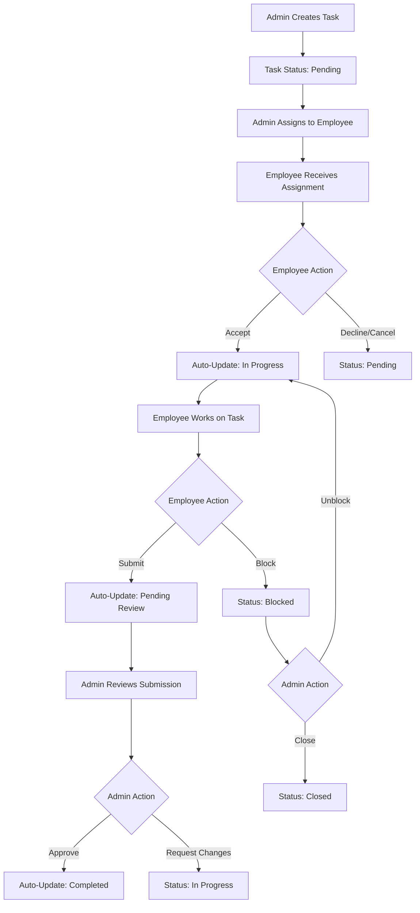

# Design Document: Automated Task Workflow

## Overview

This design document outlines the technical implementation for automating the task workflow system. The feature streamlines task status progression through automation, removes redundant interface elements, restricts admin roles to monitoring and approval, and eliminates the grading system entirely.

The current system allows manual status control by both employees and admins, includes duplicate status filtering tabs, and maintains a complex grading system. The new automated workflow will enforce a strict status progression: **Pending → In Progress → Pending Review → Completed**, triggered automatically by user actions rather than manual status changes.

### Key Changes Summary

1. **Interface Simplification**: Remove bottom status tabs (All Status, Pending, In Progress, Completed) from both employee and admin interfaces
2. **Automated Status Progression**: Employee accepts → In Progress → Employee submits → Pending Review → Admin approves → Completed
3. **Admin Role Restriction**: Remove manual status control, maintain monitoring and approval capabilities
4. **Grading System Removal**: Complete removal of grading functionality (gradeScore, gradeFeedback, isGraded fields)

## Architecture

### Current System Architecture

The existing task management system consists of:

- **Backend**: Node.js/Express with MongoDB
  - `Task` model: Global task definition
  - `UserTask` model: Per-employee task assignments with grading fields
  - `taskController.js`: Handles task operations and status transitions
- **Frontend**: Flutter mobile application
  - Employee task list with dual status tabs (top and bottom)
  - Admin task management with manual status controls
  - Grading interface for completed tasks

### New Architecture Changes

The automated workflow will modify the existing architecture by:

1. **Status Transition Engine**: Enhanced validation logic in `taskController.js`
2. **UI Simplification**: Removal of redundant filtering components
3. **Permission System**: Restricted admin capabilities
4. **Data Model Updates**: Removal of grading-related fields

### System Flow Diagram



## Components and Interfaces

### Backend Components

#### 1. Enhanced Status Transition Validation

**File**: `backend/controllers/taskController.js`

**Current Function**: `canTransitionTaskStatus(fromStatus, toStatus)`

**Enhanced Logic**:
```javascript
function canTransitionTaskStatus(fromStatus, toStatus, userRole, actionType) {
  const from = normalizeTaskStatus(fromStatus);
  const to = normalizeTaskStatus(toStatus);
  
  // Prevent manual status changes - only allow through specific actions
  if (actionType === 'manual_update') {
    return false; // Block all manual status updates
  }
  
  // Define allowed automated transitions
  const allowedTransitions = {
    'pending': ['in_progress'], // Only through employee acceptance
    'in_progress': ['pending_review', 'blocked'], // Through submission or blocking
    'pending_review': ['completed', 'in_progress'], // Through admin approval or rejection
    'blocked': ['in_progress', 'closed'], // Through admin unblock or close
    'completed': [], // Terminal state
    'closed': [] // Terminal state
  };
  
  return allowedTransitions[from]?.includes(to) || false;
}
```

#### 2. New Status Transition Methods

**Employee Actions**:
- `acceptUserTask(userTaskId)` → Auto-transition to 'in_progress'
- `submitUserTask(userTaskId)` → Auto-transition to 'pending_review'
- `blockUserTask(userTaskId, reason)` → Auto-transition to 'blocked'

**Admin Actions**:
- `approveUserTask(userTaskId)` → Auto-transition to 'completed'
- `rejectUserTask(userTaskId, reason)` → Auto-transition to 'in_progress'
- `unblockUserTask(userTaskId, note)` → Auto-transition to 'in_progress'
- `closeUserTask(userTaskId, note)` → Auto-transition to 'closed'

#### 3. Status History Tracking

Enhanced `statusHistory` array in Task model:
```javascript
statusHistory: [{
  status: String,
  changedBy: ObjectId,
  changedAt: Date,
  reason: String,
  actionType: String, // 'accept', 'submit', 'approve', 'reject', 'block', 'unblock', 'close'
  automated: Boolean // Always true for new system
}]
```

### Frontend Components

#### 1. Employee Task List Screen Modifications

**File**: `field_check/lib/screens/employee_task_list_screen.dart`

**Changes**:
- Remove bottom status filter tabs (All Status, Pending, In Progress, Completed)
- Keep top tabs: Current, Overdue, Archived
- Remove manual status change controls
- Add automated action buttons: Accept, Submit, Block

**New UI Structure**:
```dart
TabBar(
  controller: _tabController,
  tabs: const [
    Tab(text: 'Current'),    // Active tasks (pending, in_progress, pending_review)
    Tab(text: 'Overdue'),    // Overdue tasks
    Tab(text: 'Archived'),   // Completed and closed tasks
  ],
)
```

#### 2. Admin Task Management Screen Modifications

**File**: `field_check/lib/screens/admin_task_management_screen.dart`

**Changes**:
- Remove bottom status filter chips (All Status, Pending, In Progress, Completed)
- Remove manual status change dropdown
- Add approval/rejection controls for pending review tasks
- Maintain monitoring capabilities

**Removed UI Elements**:
```dart
// REMOVE THESE FILTER CHIPS:
_filterChip('All Status', _statusFilter == 'all', () {
  setState(() => _statusFilter = 'all');
}),
_filterChip('Pending', _statusFilter == 'pending', () {
  setState(() => _statusFilter = 'pending');
}),
_filterChip('In Progress', _statusFilter == 'in_progress', () {
  setState(() => _statusFilter = 'in_progress');
}),
_filterChip('Completed', _statusFilter == 'completed', () {
  setState(() => _statusFilter = 'completed');
}),
```

#### 3. Task Service Updates

**File**: `field_check/lib/services/task_service.dart`

**New Methods**:
```dart
Future<void> submitUserTask(String userTaskId) async {
  // Auto-transitions to 'pending_review'
}

Future<void> approveUserTask(String userTaskId) async {
  // Auto-transitions to 'completed'
}

Future<void> rejectUserTask(String userTaskId, String reason) async {
  // Auto-transitions to 'in_progress'
}
```

**Removed Methods**:
```dart
// REMOVE:
Future<void> gradeTask(String userTaskId, int score, String feedback) async
```

## Data Models

### Task Model Changes

**File**: `backend/models/Task.js`

**No changes required** - Task model remains unchanged as it represents the global task definition.

### UserTask Model Changes

**File**: `backend/models/UserTask.js`

**Remove grading fields**:
```javascript
// REMOVE THESE FIELDS:
grade: {
  score: { type: Number, min: 0, max: 100, required: false },
  feedback: { type: String, required: false },
  gradedAt: { type: Date, required: false },
  gradedBy: { type: mongoose.Schema.Types.ObjectId, ref: 'User', required: false },
}
```

**Enhanced status tracking**:
```javascript
status: {
  type: String,
  enum: [
    'pending',
    'pending_acceptance', 
    'accepted',
    'in_progress',
    'pending_review',    // NEW: Submitted for admin review
    'blocked',
    'completed',
    'reviewed',          // DEPRECATED: Remove after migration
    'closed',
  ],
  default: 'pending_acceptance',
},

// Add submission tracking
submittedAt: { type: Date, required: false },
submittedBy: { type: mongoose.Schema.Types.ObjectId, ref: 'User', required: false },
reviewedAt: { type: Date, required: false },
reviewedBy: { type: mongoose.Schema.Types.ObjectId, ref: 'User', required: false },
```

### Flutter Task Model Changes

**File**: `field_check/lib/models/task_model.dart`

**Remove grading fields**:
```dart
// REMOVE THESE FIELDS:
final num? gradeScore;
final String? gradeFeedback;
final bool isGraded;
```

**Add new status tracking fields**:
```dart
final DateTime? submittedAt;
final DateTime? reviewedAt;
final String? reviewNote;
```

## Status Transition Validation Logic

### Validation Rules

1. **Employee Actions**:
   - Can only accept tasks in 'pending' or 'pending_acceptance' status
   - Can only submit tasks in 'in_progress' status
   - Can only block tasks in 'in_progress' status
   - Cannot manually change status

2. **Admin Actions**:
   - Can only approve/reject tasks in 'pending_review' status
   - Can unblock tasks in 'blocked' status
   - Can close blocked tasks
   - Cannot manually change status except through approval workflow

3. **System Actions**:
   - Auto-transition 'pending' → 'in_progress' on employee acceptance
   - Auto-transition 'in_progress' → 'pending_review' on employee submission
   - Auto-transition 'pending_review' → 'completed' on admin approval
   - Auto-transition 'pending_review' → 'in_progress' on admin rejection

### Implementation

**Enhanced validation function**:
```javascript
function validateStatusTransition(currentStatus, targetStatus, userRole, actionType) {
  const transitions = {
    employee: {
      accept: { from: ['pending', 'pending_acceptance'], to: 'in_progress' },
      submit: { from: ['in_progress'], to: 'pending_review' },
      block: { from: ['in_progress'], to: 'blocked' },
      cancel: { from: ['accepted', 'in_progress'], to: 'pending_acceptance' }
    },
    admin: {
      approve: { from: ['pending_review'], to: 'completed' },
      reject: { from: ['pending_review'], to: 'in_progress' },
      unblock: { from: ['blocked'], to: 'in_progress' },
      close: { from: ['blocked'], to: 'closed' }
    }
  };

  const userTransitions = transitions[userRole];
  if (!userTransitions) return false;

  const action = userTransitions[actionType];
  if (!action) return false;

  return action.from.includes(currentStatus) && action.to === targetStatus;
}
```

## Error Handling

### Status Transition Errors

1. **Invalid Transition Attempts**:
   - Return HTTP 400 with descriptive error message
   - Log attempt for audit purposes
   - Display user-friendly error in UI

2. **Permission Violations**:
   - Return HTTP 403 for unauthorized actions
   - Display informational message about automated workflow

3. **Concurrent Modifications**:
   - Implement optimistic locking
   - Refresh task state and retry if safe
   - Display conflict resolution options

### Error Messages

```javascript
const ERROR_MESSAGES = {
  INVALID_TRANSITION: 'This action is not allowed for the current task status',
  UNAUTHORIZED_ACTION: 'You do not have permission to perform this action',
  TASK_NOT_FOUND: 'Task not found or no longer available',
  ALREADY_PROCESSED: 'This task has already been processed',
  WORKFLOW_AUTOMATED: 'Task status is managed automatically based on your actions'
};
```

## Correctness Properties

*A property is a characteristic or behavior that should hold true across all valid executions of a system-essentially, a formal statement about what the system should do. Properties serve as the bridge between human-readable specifications and machine-verifiable correctness guarantees.*

### Property 1: Status Transition Automation

*For any* task and valid user action (accept, submit, approve), the system SHALL automatically transition the task status according to the defined workflow rules: pending→in_progress (accept), in_progress→pending_review (submit), pending_review→completed (approve)

**Validates: Requirements 2.1, 2.2, 2.3, 5.1, 5.2, 5.3**

### Property 2: Status Transition Validation

*For any* attempted status transition, the system SHALL only allow transitions that follow the automated workflow rules and SHALL reject all invalid transitions with appropriate error logging

**Validates: Requirements 5.4**

### Property 3: Audit Trail Completeness

*For any* status change in the system, the audit trail SHALL always contain the user identification, accurate timestamp, and action type that triggered the change

**Validates: Requirements 2.4, 2.5, 5.5**

### Property 4: Admin Permission Enforcement

*For any* admin user and task operation (view, create, assign, approve), the system SHALL allow the operation if it's within admin permissions and SHALL reject manual status changes outside the approval process

**Validates: Requirements 3.1, 3.2, 3.3, 3.4, 3.5, 4.1, 4.2**

### Property 5: Task Creation Consistency

*For any* new task created by an admin, the system SHALL set the initial status to "Pending" and SHALL maintain all existing task creation functionality

**Validates: Requirements 4.3, 4.5**

### Property 6: Notification System Reliability

*For any* task assignment or approval requirement, the system SHALL send notifications to the appropriate users (employees for assignments, admins for approvals)

**Validates: Requirements 4.4, 6.5**

### Property 7: Admin Monitoring Capabilities

*For any* task status change or monitoring request, the system SHALL provide admins with real-time visibility, accurate metrics, and complete task history

**Validates: Requirements 6.1, 6.2, 6.3, 6.4, 6.6**

### Property 8: Grading System Removal

*For any* admin user interaction with completed tasks, the system SHALL not allow grading operations and SHALL display completion status without grade information

**Validates: Requirements 7.2, 7.5, 7.7**

### Property 9: Interface Filtering Consistency

*For any* task dataset and filter criteria applied through the top status tabs, the system SHALL produce the same filtering results as the original system while maintaining all existing functionality

**Validates: Requirements 1.4**

## Testing Strategy

## Testing Strategy

### Dual Testing Approach

The testing strategy combines **unit tests** for specific examples and edge cases with **property-based tests** for universal properties across all inputs, providing comprehensive coverage.

### Unit Tests

Unit tests focus on specific examples, edge cases, and error conditions:

1. **Status Transition Examples**:
   - Test specific status transition scenarios (pending task acceptance)
   - Test edge cases (concurrent status changes, invalid user permissions)
   - Test error conditions (missing task IDs, network failures)

2. **UI Integration Examples**:
   - Test removal of bottom status tabs in specific screen configurations
   - Test admin interface changes with sample task datasets
   - Test grading interface removal with specific user roles

3. **API Integration Examples**:
   - Test new automated action endpoints with sample requests
   - Test removal of grading endpoints (404 responses)
   - Test error handling with malformed requests

### Property-Based Tests

Property-based tests verify universal properties across many generated inputs, with each test running a minimum of 100 iterations:

1. **Status Transition Properties** (Properties 1-2):
   ```javascript
   // Feature: automated-task-workflow, Property 1: Status Transition Automation
   // Generate random tasks in various states, verify automated transitions
   ```

2. **Audit Trail Properties** (Property 3):
   ```javascript
   // Feature: automated-task-workflow, Property 3: Audit Trail Completeness
   // Generate random status changes, verify audit trail completeness
   ```

3. **Permission Properties** (Property 4):
   ```javascript
   // Feature: automated-task-workflow, Property 4: Admin Permission Enforcement
   // Generate random admin operations, verify permission enforcement
   ```

4. **System Consistency Properties** (Properties 5-9):
   ```javascript
   // Feature: automated-task-workflow, Property 5: Task Creation Consistency
   // Generate random task creation scenarios, verify consistency
   ```

### Property-Based Testing Configuration

- **Testing Library**: Use fast-check for JavaScript/Node.js backend testing
- **Minimum Iterations**: 100 iterations per property test
- **Test Tagging**: Each property test references its design document property
- **Generator Strategy**: Create custom generators for tasks, users, and status transitions

### Integration Tests

1. **Status Transition Logic**:
   - Test all valid transitions for each user role
   - Test rejection of invalid transitions
   - Test permission enforcement

2. **API Endpoints**:
   - Test new automated action endpoints
   - Test removal of manual status update capabilities
   - Test error handling and validation

### Integration Tests

1. **End-to-End Workflow**:
   - Test complete task lifecycle from creation to completion
   - Test admin approval/rejection workflow
   - Test blocking and unblocking scenarios

2. **UI Integration**:
   - Test removal of status filter tabs
   - Test new action buttons functionality
   - Test error message display

### Property-Based Tests

This feature is not suitable for property-based testing as it involves:
- UI rendering and layout changes
- Infrastructure workflow changes
- Side-effect operations (status updates, notifications)

Instead, the testing strategy focuses on:
- **Example-based unit tests** for specific status transition scenarios
- **Integration tests** for end-to-end workflow validation
- **UI snapshot tests** for interface changes

### Migration Testing

1. **Data Migration**:
   - Test removal of grading fields from existing UserTask records
   - Test status normalization for existing tasks
   - Test backward compatibility during transition period

2. **Feature Flag Testing**:
   - Test gradual rollout of automated workflow
   - Test fallback to manual system if needed
   - Test user notification of workflow changes

## Database Migration Strategy

### Phase 1: Add New Fields

```javascript
// Add new fields to UserTask schema
db.usertasks.updateMany(
  {},
  {
    $set: {
      submittedAt: null,
      submittedBy: null,
      reviewedAt: null,
      reviewedBy: null
    }
  }
);
```

### Phase 2: Migrate Existing Data

```javascript
// Convert 'reviewed' status to 'completed'
db.usertasks.updateMany(
  { status: 'reviewed' },
  { 
    $set: { 
      status: 'completed',
      reviewedAt: new Date(),
      reviewedBy: null // Will be populated from grade.gradedBy if available
    }
  }
);

// Set submittedAt for completed tasks
db.usertasks.updateMany(
  { 
    status: 'completed',
    completedAt: { $exists: true },
    submittedAt: null
  },
  [
    {
      $set: {
        submittedAt: '$completedAt'
      }
    }
  ]
);
```

### Phase 3: Remove Grading Fields

```javascript
// Remove grading fields after UI updates are deployed
db.usertasks.updateMany(
  {},
  {
    $unset: {
      'grade': '',
      'gradeScore': '',
      'gradeFeedback': '',
      'isGraded': ''
    }
  }
);
```

### Phase 4: Update Schema

Update the UserTask schema to remove grading field definitions and add new status tracking fields.

## Deployment Plan

### Phase 1: Backend Updates (Week 1)
1. Deploy enhanced status transition validation
2. Add new automated action endpoints
3. Implement data migration scripts
4. Deploy with feature flag disabled

### Phase 2: Frontend Updates (Week 2)
1. Update Flutter app with new UI structure
2. Remove grading interface components
3. Add new action buttons for automated workflow
4. Deploy with feature flag enabled for testing

### Phase 3: Data Cleanup (Week 3)
1. Run grading field removal migration
2. Update database schema definitions
3. Remove deprecated API endpoints
4. Enable automated workflow for all users

### Phase 4: Monitoring and Optimization (Week 4)
1. Monitor status transition patterns
2. Optimize database queries for new workflow
3. Gather user feedback and adjust UI
4. Remove feature flags and legacy code

## Performance Considerations

### Database Optimization

1. **Indexing Strategy**:
   ```javascript
   // Add compound index for efficient status filtering
   db.usertasks.createIndex({ 
     userId: 1, 
     status: 1, 
     isArchived: 1 
   });
   
   // Add index for admin pending review queries
   db.usertasks.createIndex({ 
     status: 1, 
     submittedAt: -1 
   });
   ```

2. **Query Optimization**:
   - Use aggregation pipelines for complex status filtering
   - Implement pagination for large task lists
   - Cache frequently accessed task counts

### Real-time Updates

1. **Socket.io Events**:
   - Emit status change events to relevant users
   - Update admin dashboards in real-time
   - Notify employees of approval/rejection decisions

2. **Event Optimization**:
   - Batch multiple status updates
   - Use room-based broadcasting for efficiency
   - Implement event deduplication

### Mobile App Performance

1. **UI Optimization**:
   - Reduce widget rebuilds with proper state management
   - Implement lazy loading for task lists
   - Use efficient list rendering for large datasets

2. **Network Optimization**:
   - Implement request caching for task data
   - Use incremental sync for status updates
   - Optimize payload sizes for mobile networks

## Security Considerations

### Permission Enforcement

1. **API Level Security**:
   - Validate user permissions on every status transition
   - Implement rate limiting for automated actions
   - Log all status changes for audit trail

2. **Role-Based Access Control**:
   ```javascript
   const PERMISSIONS = {
     employee: ['accept', 'submit', 'block', 'cancel'],
     admin: ['approve', 'reject', 'unblock', 'close', 'create', 'assign']
   };
   ```

### Data Integrity

1. **Transaction Safety**:
   - Use database transactions for status updates
   - Implement optimistic locking for concurrent access
   - Validate data consistency after updates

2. **Audit Logging**:
   - Log all status transitions with user context
   - Track automated vs manual actions
   - Maintain immutable audit trail

### Input Validation

1. **Status Transition Validation**:
   - Validate all transition requests server-side
   - Sanitize user input for reasons and notes
   - Prevent injection attacks in status updates

2. **Business Logic Validation**:
   - Ensure task assignment limits are respected
   - Validate user permissions before actions
   - Check task state consistency

This design provides a comprehensive technical foundation for implementing the automated task workflow system while maintaining data integrity, security, and performance standards.